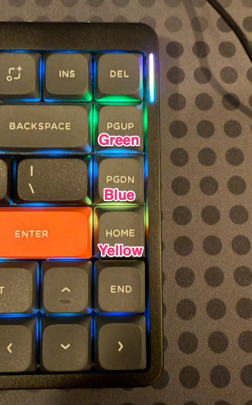
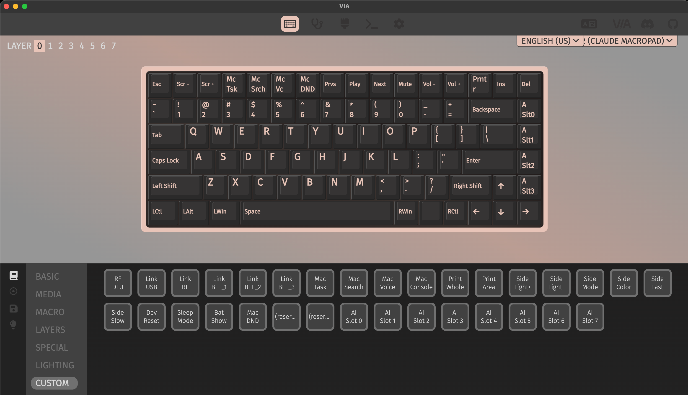

# claude-macropad

A daemon that mirrors the state of your Claude Code sessions onto a
physical keyboard — one key/LED slot per active session, color-coded
by what that session is doing (working, waiting on you, done, errored,
etc.) — pressing a key brings that session's window (Terminal, VS
Code, or IntelliJ) to the front.

Any RGB QMK keyboard works over USB HID — proven on a [NuPhy Air75
V2](https://nuphy.com/products/air75-v2). Porting to another QMK board
should take little more than adding its own keymap (VID/PID plus
per-key mapping) — the daemon, HID wire protocol, and dispatch logic
are already keyboard-agnostic; see [QMK keyboard (NuPhy Air75
V2)](#qmk-keyboard-nuphy-air75-v2) for the pattern to follow.

A second QMK board, the [Keychron K1
Pro](https://www.keychron.com/products/keychron-k1-pro-qmk-via-wireless-custom-mechanical-keyboard)
(ANSI), is also wired up, built against Keychron's own official
firmware source — but **unverified on real hardware**, and needs one
small source patch applied before it'll build; see [QMK keyboard
(Keychron K1 Pro, unverified)](#qmk-keyboard-keychron-k1-pro-unverified)
before relying on it.

This repo covers the full path end to end: an example Claude Code
`settings.json` wiring plus the hook script it invokes, a host-side
daemon that speaks a small binary protocol with the pad over USB HID,
and the QMK keymap C that runs on the pad itself.

The daemon only holds the pad's HID connection open while at least one
Claude Code session is active, releasing it shortly after the last one
ends — see [Run the daemon](#2-run-the-daemon) — so the [VIA
app](https://www.caniusevia.com/), which needs exclusive access to
that same interface, can be used without manually stopping the daemon
first.

## Pad states

Each slot's RGB color reflects that session's current state, per
`STATE_TO_CODE` in [`hid_protocol.py`](hid_protocol.py):

|     | Label        | Color                      | Internal state | When                                                                                                           |
| --- | ------------ | --------------------------- | -------------- | -------------------------------------------------------------------------------------------------------------- |
| ⚪  | idle         | dim gray `#282828`         | `idle`         | `SessionStart` — slot allocated, nothing happening yet                                                        |
| 🔵  | thinking     | blue `#0000FF`              | `working`      | Claude is reasoning between tool calls (`UserPromptSubmit`, `PostToolUse`)                                    |
| 🟣  | tool running | purple `#8000FF`            | `tool_running` | A tool call is actively executing (`PreToolUse`)                                                              |
| 🟢  | complete     | green `#00FF00`            | `done`         | `Stop` — Claude finished responding                                                                           |
| 🟠  | needs input  | orange `#FF7F00`, blinking | `question`     | Blocked on you: `AskUserQuestion`, `ExitPlanMode`, `PermissionRequest`, or `Notification:agent_needs_input`   |
| 🟣  | tool stalled | purple `#8000FF`, blinking | `tool_stalled` | A tool call has been pending past `STALL_THRESHOLD_SECONDS` with no `PostToolUse` — may or may not be blocked |
| 🟡  | waiting      | amber `#FFAA00`             | `waiting`      | Claude's been idle 60s+ with nothing blocking (`Notification:idle_prompt`) — lower urgency than "needs input" |
| 🔴  | error        | red `#FF0000`              | `error`        | `PostToolUseFailure`                                                                                           |

"needs input" and "tool stalled" blink (0.5s on/off) so each reads as
distinct from its solid-color sibling at a glance — "needs input" from
"waiting" despite sharing a similarly warm color, and "tool stalled"
from "tool running" despite sharing the same purple hue.

A slot that receives a state it doesn't recognize — e.g. older
firmware talking to a newer daemon that's added a state since it was
last flashed — renders solid magenta `#FF00FF` instead of silently
falling back to idle or off, which would look like nothing's wrong.
This is a fallback rendering behavior, not a state `hook_to_state`
ever produces on purpose.

**Only tested on macOS.** Window-dispatch (tmux/Terminal.app/VS
Code/IntelliJ activation) uses AppleScript and is macOS-only outright;
the rest (daemon, hook.sh, HID protocol) may work elsewhere but hasn't
been tried.

### NuPhy Air75 V2 (QMK) Working Example



## Repo layout

| Path                                | Description                                                                                               |
| ----------------------------------- | --------------------------------------------------------------------------------------------------------- |
| `daemon.py`                         | Host-side daemon: Unix socket server + hook-event → pad-state mapping + idle-release orchestration        |
| `pad_link.py`                       | Owns the HID connection to the pad: discovery, open/close, read/write, reconnection                       |
| `hid_protocol.py`                   | Wire-level binary report format for the HID transport (QMK-based pads) — see [Protocol](#protocol)        |
| `fake_hooks.py`                     | Simulates a Claude Code session's hook events, for testing the daemon without real hooks wired up         |
| `hid_bringup_test.py`               | Standalone hello/RGB round-trip check against a real QMK pad, independent of `daemon.py`                  |
| `qmk-userspace/`                    | QMK userspace overlay, built against a separate local QMK checkout — `users/claude_macropad/` holds the protocol/state logic shared by every board's keymap; `keyboards/.../keymaps/claude_macropad/` holds each board's own layout, LED map, and device ID. Keychron K1 Pro also ships `keyboards/keychron/k1_pro/k1_pro.c.patch`, a small patch applied to that board's own (unmodified-otherwise) firmware checkout — see [QMK keyboard (Keychron K1 Pro, unverified)](#qmk-keyboard-keychron-k1-pro-unverified) for why |
| `requirements.txt`                  | Python dependencies for the daemon                                                                        |
| `requirements-dev.txt`              | Adds `pytest` on top of `requirements.txt`, for running the test suite                                    |
| `tests/`                            | `pytest` suite for `daemon.py`, `pad_link.py`, and `hid_protocol.py` (see [Testing](#testing))             |
| `claude/example_hook_settings.json` | `hooks` block to merge into `settings.json`, wiring every relevant event to `hook.sh`                     |
| `claude/hook.sh`                    | Reads a hook payload from stdin, enriches it, and forwards it to the daemon's socket                      |

## How it fits together

```
Claude Code hooks --> hook.sh -->   daemon.py    <-- USB HID --> QMK keyboard
                                  (Unix socket)
```

`daemon.py` listens on a Unix domain socket at `~/.claude-macropad/daemon.sock`
for line-delimited JSON hook payloads, maps each one to a display state
for the originating session, and pushes that state to the pad over USB
HID. It also reads events back from the pad (key presses) and
dispatches them.

## Hardware

Any pad needs **a USB-C cable that carries data, not just power.** A
lot of USB-C cables are charge-only, and the HID link needs one that
actually supports data transfer.

### QMK keyboards (NuPhy Air75 V2 and others)

No separate switches/keycaps shopping list here — a prebuilt keyboard
with per-key RGB is the whole requirement. This repo's keymap is
proven on the [NuPhy Air75 V2](https://nuphy.com/products/air75-v2);
any other QMK board with per-key RGB matrix support (`RGB_MATRIX_ENABLE`)
should work with a keymap of its own — see [QMK keyboard (NuPhy Air75
V2)](#qmk-keyboard-nuphy-air75-v2) for the pattern to follow when
porting to a different board. A [Keychron K1
Pro](https://www.keychron.com/products/keychron-k1-pro-qmk-via-wireless-custom-mechanical-keyboard)
(ANSI) keymap is also included, but unverified — see [QMK keyboard
(Keychron K1 Pro, unverified)](#qmk-keyboard-keychron-k1-pro-unverified).

## Setup

### 1. Flash your pad

Follow whichever subsection matches your hardware; the rest of Setup
(steps 2-4 below) is shared.

#### QMK keyboard (NuPhy Air75 V2)

Verified against real hardware. 4 slots wired by default (PageUp/PageDn/Home/End), each
showing one Claude Code session's state via per-key RGB, and pressing one brings that
session's window to the front (`dispatch_bring_to_front` in `daemon.py`). On boards
built with `VIA_ENABLE` (this one is), up to 8 slots are reachable from the VIA app — drag
one of the "AI Slot 4".."AI Slot 7" custom keycodes (see `via.json` in the keymap directory)
onto any spare key in the [VIA app](https://www.caniusevia.com/) and it lights up
automatically; remap a slot key away and its LED goes dark just as automatically. (The shared
firmware actually supports up to 12 slots, but VIA's app hard-caps `customKeycodes` at 32
total entries, and NuPhy's own stock entries already use most of that budget — see the
comment above `enum claude_macropad_keycodes` in `keymap.c` for the exact accounting.) The
keymap source lives in this repo under
`qmk-userspace/` (a [QMK userspace
overlay](https://docs.qmk.fm/newbs_external_userspace)), built against a separate local QMK
checkout that isn't part of this repo:

```
git clone --branch nuphy-keyboards https://github.com/nuphy-src/qmk_firmware.git ../nuphy-qmk-firmware
cd ../nuphy-qmk-firmware && git submodule update --init --recursive
brew install qmk/qmk/qmk    # plus arm-none-eabi-gcc@8 (osx-cross/arm tap) for this board's STM32F072
qmk config user.qmk_home=../nuphy-qmk-firmware

cd ../claude-qmk/qmk-userspace
QMK_USERSPACE="$(pwd)" qmk compile -kb nuphy/air75_v2/ansi -km claude_macropad
```

To flash: unplug the board (or just turn it off), hold **Esc**, plug it back in over USB-C
(or turn it back on) — this is QMK bootmagic (default row/col 0,0 = Esc on this board), not
anything keymap-specific, so it works for recovery too regardless of what firmware is
currently on the board:

```
QMK_USERSPACE="$(pwd)" qmk flash -kb nuphy/air75_v2/ansi -km claude_macropad
```

Then verify the wire protocol works before trusting the full daemon to it —
[`hid_bringup_test.py`](hid_bringup_test.py) pings the board directly (bypassing `daemon.py`
entirely) and cycles every slot the board reports through every state so you can watch the
real LEDs:

```
python3 hid_bringup_test.py
```

##### Using the VIA app

**The VIA app and `daemon.py` can't hold the pad open at the same time.** Both talk to the
same raw HID interface (our protocol deliberately shares VIA's endpoint rather than using a
separate one), and macOS enforces exclusive access to it at the OS level — whichever one opens
it first locks the other out, and VIA will report the keyboard as "not responding like a
VIA-enabled keyboard" if it loses that race. The daemon only holds the interface open while at
least one Claude Code session is active (see [Run the daemon](#2-run-the-daemon)), releasing it
a few seconds after the last one ends — so in practice this just means: **open VIA while no
session is running**, or wait a few seconds after your last session ends. If VIA still reports
the keyboard as unresponsive, the daemon likely has an active session and hasn't released the
handle yet; stop it manually (or end the session) and retry.

To reassign slots (e.g. to move a default slot off PageUp/PageDn/Home/End, or to put "AI Slot
4".."AI Slot 7" on a spare key):

1. In VIA's Settings page, enable **Show Design tab**.
2. In the new Design tab, manually load
   [`via.json`](qmk-userspace/keyboards/nuphy/air75_v2/ansi/keymaps/claude_macropad/via.json)
   (this board isn't in VIA's official keyboard registry, so it won't be auto-detected —
   loading the file directly is what tells VIA how to talk to it).
3. Switch to the Configure tab, make sure **layer 0** is selected, and drag any of the custom
   "AI Slot N" keycodes (bottom-left CUSTOM section) onto the key you want it to live on — or
   drag any other keycode onto PageUp/PageDn/Home/End to move a default slot elsewhere.



Reassignments take effect immediately — no reflashing needed. `claude_macropad.c`'s dynamic
scan picks up wherever a slot key actually is the moment you make the change (see the "Dynamic
AI-agent slots" work in this repo's history for how that works), and once you restart the
daemon it'll rediscover the board with whatever layout you left it in.

Porting to a different QMK board follows the same shape: a new keymap directory under
`qmk-userspace/keyboards/`, with just its layout, LED-index table, and device ID — the
HID protocol and `dispatch_bring_to_front` logic itself is shared code in
`qmk-userspace/users/claude_macropad/`, not duplicated per board. Keep the keymap named
`claude_macropad` (i.e. still `-km claude_macropad`) so QMK's build picks up that shared
`users/claude_macropad/` directory automatically.

#### QMK keyboard (Keychron K1 Pro, unverified)

**Unverified on real hardware.** Unlike the Air75 keymap above, nobody has built, flashed, or
tested this one against a real board — treat everything below as a documented best-effort, not
a confirmed working path. That said, it's built against Keychron's own official firmware source
(the [`Keychron/qmk_firmware`](https://github.com/Keychron/qmk_firmware) fork, `wireless_playground`
branch), not a third-party reverse-engineered one — the ANSI layout, matrix, RGB LED indices, and
VID/PID all come directly from Keychron's real `keyboards/keychron/k1_pro/ansi/rgb/`, and the base
keymap layers are Keychron's own stock K1 Pro keymap, unmodified except for the 4 AI-slot key
substitutions. What's unverified is specifically "does it work on a real board" — not "is this
guessed at."

One small, unavoidable wrinkle: `k1_pro.c` (board-level code, shared by every keymap for this
board — not something this repo's keymap directory touches) already defines `via_command_kb()`,
the same raw-HID early-intercept hook the Air75 keymap uses directly, to handle two vendor
commands (bluetooth DFU, factory test). A keymap can't also define `via_command_kb()` itself —
duplicate strong symbol, hard link error — so this board needs one small patch applied to that
file first, adding a new empty-by-default hook (`raw_hid_receive_kb()`) that `via_command_kb()`
falls through to for anything it doesn't already claim, which is where this keymap's own
`raw_hid_receive_kb()` (in `keymap.c`) plugs in. The patch is 12 lines, touches nothing any other
keymap for this board relies on, and ships in this repo as a diff. It's also been submitted
upstream as [Keychron/qmk_firmware#506](https://github.com/Keychron/qmk_firmware/pull/506) — if
that gets merged, this manual step goes away for anyone building against a checkout that
includes it; worth checking before you patch by hand.

```
git clone --branch wireless_playground https://github.com/Keychron/qmk_firmware.git ../keychron-qmk-firmware
cd ../keychron-qmk-firmware && git submodule update --init --recursive
brew install qmk/qmk/qmk    # plus an ARM cross-compiler for this board's STM32L432
qmk config user.qmk_home=../keychron-qmk-firmware

git apply ../claude-macropad/qmk-userspace/keyboards/keychron/k1_pro/k1_pro.c.patch
# (already cd'd into ../keychron-qmk-firmware above — the patch's paths
# are relative to that repo's root, so no --directory needed here)

cd ../claude-macropad/qmk-userspace
QMK_USERSPACE="$(pwd)" qmk compile -kb keychron/k1_pro/ansi/rgb -km claude_macropad
```

To flash, per [Keychron's own
readme](https://github.com/Keychron/qmk_firmware/blob/wireless_playground/keyboards/keychron/k1_pro/readme.md):
connect the USB-C cable, toggle the board's Mac/Win mode switch to **Off**, hold down **Esc**
(or the reset button underneath the spacebar), then toggle the switch to **Cable**:

```
QMK_USERSPACE="$(pwd)" qmk flash -kb keychron/k1_pro/ansi/rgb -km claude_macropad
```

Then, same as the Air75 board, verify the wire protocol directly before trusting the daemon to
it — `python3 hid_bringup_test.py` — and only move on once you've watched the real LEDs cycle
through every state correctly.

Slot wiring, VIA reassignment, and the VIA/daemon exclusivity rule are all the same as [the
Air75 board above](#qmk-keyboard-nuphy-air75-v2) — same 4 default slots (PageUp/PageDn/Home/End),
same `claude_macropad`-named keymap directory, same idle-release behavior for VIA access,
same `via.json`-loading Design-tab step (load
[this board's `via.json`](qmk-userspace/keyboards/keychron/k1_pro/ansi/rgb/keymaps/claude_macropad/via.json)
instead, which extends Keychron's own official VIA definition for this board rather than
replacing it). One difference: this board's 13 stock custom keycodes (left/right Option, left/right
Cmd, Task View, File Explorer, Screenshot, Cortana, Siri, 3 bluetooth host slots, battery level)
use up less of VIA's 32-entry `customKeycodes` budget than the Air75 board's 24 do, so all 12
`AI_AGENT_KEY_0`..`11` slots are nameable ("AI Slot 0".."AI Slot 11"), not just 8 of them.

### 2. Run the daemon

```
python3 -m venv venv
source venv/bin/activate
pip install -r requirements.txt

python3 daemon.py
```

The daemon auto-detects the pad (`pad_link.discover_hid_pad()`),
trying each board in `hid_protocol.KNOWN_HID_PADS` (NuPhy Air75 V2,
Keychron K1 Pro) in turn — sending each candidate raw-HID interface a
ping and attaching to whichever one answers hello first via
`discover_hid_device()`. No need to look up device paths by hand or
update them after a replug.

Needs `pip install hid` (already in `requirements.txt`) plus the
native hidapi library (`brew install hidapi` on macOS) — both
optional, and skipped gracefully (falls back to headless, same as
finding no pad at all) if either is missing.

If no pad is found, the daemon still runs — it just logs what it
_would_ send instead of writing to the device. This lets you develop
against the socket/slot-mapping logic without any hardware plugged in.

The daemon only holds the pad connection open while at least one
Claude Code session is active (`Daemon._reconcile_pad()` in
`daemon.py`) — it's released `IDLE_CLOSE_GRACE_SECONDS` (5s by
default) after the last session ends, or shortly after startup if the
daemon starts with none running, and reacquired lazily on the next
`SessionStart`. This is what lets the [VIA app](#using-the-via-app)
share the same raw HID interface without you having to manually stop
the daemon first — see that section for the exclusivity details.

Before it starts accepting hook events, the daemon also seeds slots
for any Claude Code sessions that were *already* running — e.g. a
daemon restart while sessions are mid-conversation — by shelling out
to `claude agents --json` (Claude Code ≥2.1.224) and allocating a slot
per session it reports, so the pad shows them immediately instead of
waiting for each one to happen to fire a hook event first. Requires an
up-to-date `claude` on `PATH`; an older CLI (or none at all) just
means seeding finds nothing, and pre-existing sessions fall back to
picking up a slot lazily on their first hook event instead. Every
*other* slot — anything not claimed by a real session in that
`claude agents --json` output — gets explicitly cleared to off, so a
slot left glowing by a session that died without a clean `SessionEnd`
(a crash, `kill -9`, or a previous daemon run that never shut down
properly) doesn't linger forever; the pad has no way to know the old
daemon process is gone, so nothing else would ever revisit that slot
otherwise (see `Daemon.seed_existing_sessions()` in `daemon.py`).

### 3. Try it without real hooks

To exercise the daemon before wiring up real hooks (or anytime you don't
have a live Claude Code session handy), use `fake_hooks.py` to simulate
a session's hook lifecycle against a running daemon:

```
python3 fake_hooks.py                # one simulated session
python3 fake_hooks.py --sessions 3   # three concurrent sessions, staggered
```

Each run walks through `SessionStart` → prompt → tool calls (including
one that should light the slot up as "question", e.g. `AskUserQuestion`)
→ `Stop` → `SessionEnd`, with pauses in between so you can watch the pad
react in real time.

### 4. Wire up real Claude Code hooks

1. Copy the script and make it executable. `daemon.py` also creates this
   directory itself on startup (it hosts `daemon.sock` and `events.log`
   too), so this step just needs to happen before the first real hook
   fires:

   ```
   mkdir -p "$HOME/.claude-macropad"
   cp claude/hook.sh "$HOME/.claude-macropad/hook.sh"
   chmod +x "$HOME/.claude-macropad/hook.sh"
   ```

   It needs `jq` and a `nc` build that supports Unix-domain sockets
   (`-U`, e.g. macOS's built-in `nc`) on `PATH`.

2. Merge the `"hooks"` block from
   [`claude/example_hook_settings.json`](claude/example_hook_settings.json)
   into your Claude Code `settings.json` (global `~/.claude/settings.json`
   or a project's `.claude/settings.json`). It registers
   `$HOME/.claude-macropad/hook.sh` as a command hook for every event
   `handle_hook_event()` cares about (`SessionStart`, `UserPromptSubmit`,
   `PreToolUse`, `PermissionRequest`, `PostToolUse`, `PostToolUseFailure`,
   `Notification`, `Stop`, `SubagentStop`, `SessionEnd`). The
   `Notification` entries split on `matcher` (`agent_needs_input` vs.
   `idle_prompt`) and pass `MACROPAD_NOTIFICATION_TYPE` as an env var,
   since that's the reliable way to know which subtype fired for a given
   invocation (`Notification:permission_prompt` itself is not wired up —
   see [`hook_to_state`'s
   docstring](daemon.py) for why).

[`claude/hook.sh`](claude/hook.sh) reads the hook's JSON payload from
stdin (Claude Code already includes `hook_event_name` and `session_id`
in it) and forwards it to `~/.claude-macropad/daemon.sock` via `nc -U`, after
using `jq` to fill in a few fields the payload doesn't reliably carry on
its own:

- `notification_type`, from the `MACROPAD_NOTIFICATION_TYPE` env var set
  by the matcher branch in `settings.json`.
- `tmux_pane`, from the script's own `$TMUX_PANE` (empty if not running
  inside tmux).
- `controlling_tty`, at `SessionStart` only: Claude Code runs hook
  commands detached with no controlling terminal, so the script instead
  reads the _parent_ process's tty via `ps -o tty= -p "$PPID"` — the
  process Claude Code actually spawned still has one.

It fails open by design (redirects `nc`'s output away, always exits 0)
so a daemon that isn't running never blocks a tool call or a session,
and caps the socket write at one second so `PreToolUse`/`PostToolUse` —
which fire on every tool call — stay fast.

## Testing

```
pip install -r requirements-dev.txt
python3 -m pytest
```

All tests run against fakes — no real HID device, socket, or hardware
needed (not even the native hidapi library — a fake `hid` module
stands in for it):

- `daemon.py`'s logic (`hook_to_state`, `SlotManager`,
  `Daemon.handle_hook_event`, stall escalation, window-dispatch
  fallthrough) is tested directly, with `subprocess.run` and
  `HidPadLink.write_json` swapped for recording fakes via
  `monkeypatch`.
- `pad_link.HidPadLink` and `discover_hid_device()` are tested against
  a fake `hid` module (`tests/test_hid_pad_link.py`) — including a
  fake raw-HID interface that only answers on the right
  `usage_page`/`usage`, like the real board's raw HID endpoint
  alongside its normal keyboard interfaces — and its `open()`/`close()`
  reentrancy (safe to call repeatedly on the same instance, needed by
  the idle-release cycle below).
- `hid_protocol.py`'s report encode/decode round-trips
  (`tests/test_hid_protocol.py`).
- The slots-from-handshake path (`HidPadLink.handshake()`,
  `Daemon.apply_handshake()`) is tested in `tests/test_pad_handshake.py`,
  including the timeout/no-reply/headless cases.
- Startup seeding of pre-existing sessions (`discover_running_sessions()`,
  `Daemon.seed_existing_sessions()`, and the tty/tmux-pane backfill
  helpers) is tested in `tests/test_seed_existing_sessions.py`, with
  `subprocess.run` swapped for a recording fake the same way as the
  other discovery tests.
- The idle-release orchestration (`Daemon._reconcile_pad()`,
  `Daemon._kick_reconcile()` — opening the pad when a session starts,
  closing it after `IDLE_CLOSE_GRACE_SECONDS` once the last one ends,
  and staying open if a new session starts before that delay elapses)
  is tested in `tests/test_pad_idle_release.py` against a fake pad
  that just tracks open()/close() calls.

## Protocol

### Hook events in (socket → daemon)

Each line written to `~/.claude-macropad/daemon.sock` is a single JSON object
with (at minimum) `hook_event_name` and `session_id`, matching the shape
of a Claude Code hook payload. Recognized fields:

| Field               | Used for                                                                                                         |
| ------------------- | ---------------------------------------------------------------------------------------------------------------- |
| `hook_event_name`   | Selects the resulting pad state (see below)                                                                      |
| `session_id`        | Identifies which pad slot this event belongs to                                                                  |
| `cwd`               | Project folder name — used for VS Code/IntelliJ window-dispatch matching (QMK pads are RGB-only, no on-device label) |
| `tool_name`         | Distinguishes attention-worthy tools (`AskUserQuestion`, `ExitPlanMode`) and labels the slot during `PreToolUse` |
| `notification_type` | Distinguishes `Notification` subtypes (`agent_needs_input`, `idle_prompt`, ...)                                  |
| `tmux_pane`         | tmux pane id, for the "bring to front" key-press dispatch                                                        |
| `controlling_tty`   | Terminal.app tty, for the same dispatch when not in tmux                                                         |

`hook_event_name` maps to a display state roughly as:

| Event                                                                      | State          |
| -------------------------------------------------------------------------- | -------------- |
| `SessionStart`                                                             | `idle`         |
| `UserPromptSubmit`, `PostToolUse`                                          | `working`      |
| `PreToolUse` (generic tool)                                                | `tool_running` |
| `PreToolUse` with `AskUserQuestion`/`ExitPlanMode`, or `PermissionRequest` | `question`     |
| `PostToolUseFailure`                                                       | `error`        |
| `Stop`                                                                     | `done`         |
| `Notification` (`agent_needs_input`)                                       | `question`     |
| `Notification` (`idle_prompt`)                                             | `waiting`      |
| `SessionEnd`                                                               | slot cleared   |

A `PreToolUse` with no matching `PostToolUse`/`PostToolUseFailure` within
`STALL_THRESHOLD_SECONDS` (default 10s) is escalated to `tool_stalled`
(blinking purple) as a backstop, since `Notification:permission_prompt`
isn't reliable enough to depend on alone. This deliberately stops short
of claiming `question` (definitely blocked on you) — the daemon can't
actually tell whether a stalled tool call is an unreported permission
prompt or just a slow tool, so `tool_stalled` only claims "this is
taking a while." If a definite `question` signal (`PermissionRequest`,
`Notification:agent_needs_input`) does arrive for that same pending
call, the stall tracking for it is dropped — the slot's already showing
a stronger, more specific state than a guess, and shouldn't get
clobbered back to `tool_stalled` once the threshold elapses from the
original `PreToolUse`.

Slots are allocated first-fit and freed on `SessionEnd`. The number of
slots comes from the pad's own `hello` handshake at startup (whatever
a QMK-based pad reports — see `Daemon.apply_handshake()` in
`daemon.py`), with `NUM_SLOTS` (12) used as a fallback if the pad is
headless or doesn't answer the handshake in time.

Sessions already running when the daemon starts are seeded into slots
up front via `claude agents --json`, rather than waiting for their next
hook event — see `Daemon.seed_existing_sessions()` in `daemon.py` and
[Run the daemon](#2-run-the-daemon) above.

### Pad messages (HID reports)

Fixed-size 32-byte raw HID reports in both directions — see
`hid_protocol.py` for the encode/decode helpers and exact byte layout:

| Byte 0 (type) | Direction       | Bytes 1-2                          |
| ------------- | --------------- | ---------------------------------- |
| `MSG_PING`    | daemon → device | (none)                             |
| `MSG_HELLO`   | device → daemon | device id, `slots`                 |
| `MSG_SLOT`    | daemon → device | slot index, state (0-31, see below) |
| `MSG_KEY`     | device → daemon | slot index                         |

`ping`/`hello` is the handshake `discover_hid_device()` uses to confirm
a given raw-HID interface is actually the pad, not some other board's.

State bytes are `hid_protocol.STATE_TO_CODE`'s values (`idle`=0,
`working`=1, `waiting`=2, `done`=3, `error`=4, `question`=5,
`tool_running`=6, `tool_stalled`=7, ..., `off`=31) — the same values
the QMK firmware's own state enum mirrors. `off`=31 is deliberately
pinned well above the states defined today rather than "whatever's
defined last" — adding a future state only means picking the next
unused number below it, never renumbering `off` (and the QMK side's
`state <= STATE_OFF` bounds check, which is anchored to its value)
again. Values in between that are reserved-but-unused today, or a
value newer than what a given firmware build understands, render as
the "unknown" fallback color described above. There's no separate
"clear" report — an RGB-only pad has no label to clear, so a cleared
slot is just `MSG_SLOT` with state `off` (fully dark — distinct from
`idle`'s dim glow).

A key press is sent on key-down only (no key-up equivalent — see
`MSG_KEY` above) and, on the daemon side, logs which session it
corresponds to and attempts to bring that session's window to the
front (tried in order: tmux pane, Terminal.app tab by tty, VS Code
window by project name, IntelliJ IDEA window by project name) — all
via AppleScript, so this is macOS-only for now.

## Logs

- Console: human-readable, `INFO` level.
- `~/.claude-macropad/events.log`: rotating (5MB × 3 files) raw event
  log — every socket line (parsed or not), every state mapping decision,
  and every window-dispatch attempt/result. Useful for diagnosing a
  framing or mapping bug after the fact without reproducing it live.

## Status

This is early-stage, but the path from a real Claude Code session to the
pad now works end to end:

- ✅ Claude Code hook wiring (`settings.json` block + `hook.sh`)
- ✅ Socket server + hook-event → pad-state mapping
- ✅ HID protocol to/from QMK keyboards (e.g. NuPhy Air75 V2), with pad auto-discovery
- ✅ Slot allocation for concurrent sessions
- ✅ Key-press → bring-window-to-front dispatch (macOS)
- ✅ Startup seeding of already-running sessions (`claude agents --json`)
- ✅ Idle-release: the pad connection closes when no session is active, freeing it for VIA
- ⚠️ Keychron K1 Pro (ANSI) QMK keymap — written against Keychron's own official firmware
  source, unverified on real hardware (see [QMK keyboard (Keychron K1 Pro,
  unverified)](#qmk-keyboard-keychron-k1-pro-unverified))

## Prior hardware: Adafruit MacroPad RP2040

Earlier versions of this project also supported the [Adafruit MacroPad
RP2040](https://www.adafruit.com/product/5100) over USB serial
(CircuitPython, a 12-key macropad with an OLED label per slot). That
support has been removed — this project has moved fully to QMK/HID
boards — but the firmware, host-side serial transport, and docs are
still browsable at the last commit that had them:
[`rp2040/`](https://github.com/pickypg/claude-macropad/tree/35ae51c7795e9f09feca3bb8bfdeea76b58eb60f/rp2040)
(and that commit's
[README](https://github.com/pickypg/claude-macropad/blob/35ae51c7795e9f09feca3bb8bfdeea76b58eb60f/README.md)
for the full serial protocol writeup and build steps).


## License

MIT — see [LICENSE](LICENSE).
