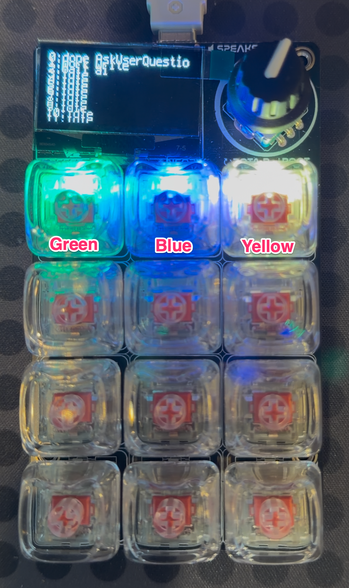

# claude-macropad

A daemon that mirrors the state of your Claude Code sessions onto an
[Adafruit MacroPad RP2040](https://www.adafruit.com/product/5100) — one
key/LED slot per active session, color-coded by what that session is
doing (working, waiting on you, done, errored, etc.), with the OLED
showing a label per slot.

This repo covers the full path end to end: an example Claude Code
`settings.json` wiring plus the hook script it invokes, a host-side
daemon that speaks a small JSON protocol with the MacroPad over USB
serial, and the CircuitPython code that runs on the device itself.

## Pad states

Each slot's NeoPixel color reflects that session's current state, per
`STATE_COLORS` in [`rp2040/code.py`](rp2040/code.py):

|     | Label       | Color                      | Internal state | When                                                                                                          |
| --- | ----------- | -------------------------- | -------------- | ------------------------------------------------------------------------------------------------------------- |
| ⚪  | idle        | dim gray `#282828`         | `idle`         | `SessionStart` — slot allocated, nothing happening yet                                                        |
| 🔵  | thinking    | blue `#0000FF`             | `working`      | A prompt was submitted or a tool is running (`UserPromptSubmit`, `PreToolUse`, `PostToolUse`)                 |
| 🟢  | complete    | green `#00FF00`            | `done`         | `Stop` — Claude finished responding                                                                           |
| 🟠  | needs input | orange `#FF7F00`, blinking | `question`     | Blocked on you: `AskUserQuestion`, `ExitPlanMode`, `PermissionRequest`, or `Notification:agent_needs_input`   |
| 🟡  | waiting     | amber `#FFAA00`            | `waiting`      | Claude's been idle 60s+ with nothing blocking (`Notification:idle_prompt`) — lower urgency than "needs input" |
| 🔴  | error       | red `#FF0000`              | `error`        | `PostToolUseFailure`                                                                                          |

"needs input" blinks (0.5s on/off, `BLINK_PERIOD` in `rp2040/code.py`)
so it reads as distinct from "waiting" at a glance despite the two
sharing a similarly warm color.



**Only tested on macOS.** Window-dispatch (tmux/Terminal.app/VS
Code/IntelliJ activation) uses AppleScript and is macOS-only outright;
the rest (daemon, hook.sh, serial protocol) may work elsewhere but
hasn't been tried.

## Repo layout

| Path                                | Description                                                                                               |
| ----------------------------------- | --------------------------------------------------------------------------------------------------------- |
| `daemon.py`                         | Host-side daemon: Unix socket server + serial link to the pad                                             |
| `fake_hooks.py`                     | Simulates a Claude Code session's hook events, for testing the daemon without real hooks wired up         |
| `requirements.txt`                  | Python dependencies for the daemon                                                                        |
| `requirements-dev.txt`              | Adds `pytest` on top of `requirements.txt`, for running the test suite                                    |
| `tests/`                            | `pytest` suite for `daemon.py` and `rp2040/code.py` (see [Testing](#testing))                             |
| `rp2040/boot.py`                    | Enables the USB serial data endpoint (runs on device boot) — copied onto the MacroPad's CIRCUITPY drive   |
| `rp2040/code.py`                    | Main device loop: renders pad state, reads key/encoder input — copied onto the MacroPad's CIRCUITPY drive |
| `claude/example_hook_settings.json` | `hooks` block to merge into `settings.json`, wiring every relevant event to `hook.sh`                     |
| `claude/hook.sh`                    | Reads a hook payload from stdin, enriches it, and forwards it to the daemon's socket                      |

## How it fits together

```
Claude Code hooks --> hook.sh -->   daemon.py    <-- USB serial --> MacroPad RP2040
                                  (Unix socket)
```

`daemon.py` listens on a Unix domain socket at `~/.claude-macropad.sock`
for line-delimited JSON hook payloads, maps each one to a display state
for the originating session, and pushes that state to the MacroPad over
a USB serial connection. It also reads events back from the pad (key
presses, encoder turns) and logs them.

## Hardware

Beyond the [MacroPad RP2040](https://www.adafruit.com/product/5100)
board itself, getting a fully functional pad requires:

1. **The base board** (linked above).
2. **12 MX-compatible mechanical switches, with RGB support.** This
   project is built on Cherry MX Red RGB switches. Get RGB-capable
   switches specifically — without them, the [color-coded states above](#pad-states)
   have nowhere to show, and the pad's usefulness drops to just the
   OLED text and window-selection on keypress.
3. **12 MX-compatible keycaps** (technically optional — the switches
   work bare). To actually see the color, the keycaps need to
   shine-through (translucent), not opaque.
4. **A USB-C cable that carries data, not just power.** A lot of
   USB-C cables are charge-only; the daemon's serial link needs one
   that actually supports data transfer.

If you can get the [MacroPad RP2040 Starter
Kit](https://www.adafruit.com/product/5128), it bundles the board, RGB
switches, and keycaps together — the simplest path when it's in stock.

Otherwise, buy the bare-bones board, switches, and keycaps separately.
An [acrylic enclosure](https://www.adafruit.com/product/5103) is also
available and optional, but recommended for protecting the board.

## Setup

### 1. Flash the MacroPad

1. Put the MacroPad RP2040 into CircuitPython (see
   [Adafruit's guide](https://learn.adafruit.com/adafruit-macropad-rp2040)
   if it isn't already).
2. From the [Adafruit CircuitPython Library
   Bundle](https://circuitpython.org/libraries) matching your device's
   CircuitPython version, copy these into `CIRCUITPY/lib`:
   - `adafruit_macropad`
   - `adafruit_display_text`
   - `adafruit_debouncer`
   - `neopixel`
   - `adafruit_bus_device`
3. Copy [`rp2040/boot.py`](rp2040/boot.py) and [`rp2040/code.py`](rp2040/code.py)
   to the root of `CIRCUITPY`, overwriting any existing `boot.py`/`code.py`.
4. Reset the board (a fresh `boot.py` only takes effect after a reset,
   not a soft reload). All 12 keys should light up dim gray ("idle").

### 2. Run the daemon

```
python3 -m venv venv
source venv/bin/activate
pip install -r requirements.txt

python3 daemon.py
```

The daemon auto-detects the pad on startup: it scans USB serial devices
for Adafruit's vendor ID, sends each a `{"t": "ping"}`, and attaches to
whichever one answers `{"t": "hello", "device": "claude-macropad-v1"}` (see
the `ping`/`hello` handshake in [`rp2040/code.py`](rp2040/code.py) and
`discover_port()` in [`daemon.py`](daemon.py)). No need to look up
`/dev/cu.usbmodem*` by hand or update it after a replug.

If you have more than one CircuitPython board attached, or want to skip
discovery, force a specific port with `MACROPAD_SERIAL_PORT`:

```
MACROPAD_SERIAL_PORT=/dev/cu.usbmodem14201 python3 daemon.py
```

**Use the `/dev/cu.*` device, not `/dev/tty.*`** — the `tty` node blocks
on carrier-detect and can hang `pyserial`'s `Serial()` open call until
the board is unplugged.

If no pad is found (and `MACROPAD_SERIAL_PORT` isn't set), the daemon
still runs — it just logs what it _would_ send instead of writing to a
port. This lets you develop against the socket/slot-mapping logic
without the hardware plugged in.

### 3. Try it without real hooks

To exercise the daemon before wiring up real hooks (or anytime you don't
have a live Claude Code session handy), use `fake_hooks.py` to simulate
a session's hook lifecycle against a running daemon:

```
python3 fake_hooks.py                # one simulated session
python3 fake_hooks.py --sessions 3   # three concurrent sessions, staggered
```

Each run walks through `SessionStart` → prompt → tool calls (including
one that should light the slot up as "question", e.g. `AskUserQuestion`)
→ `Stop` → `SessionEnd`, with pauses in between so you can watch the pad
react in real time.

### 4. Wire up real Claude Code hooks

1. Copy the script and make it executable:

   ```
   mkdir -p "$HOME/.claude-macropad"
   cp claude/hook.sh "$HOME/.claude-macropad/hook.sh"
   chmod +x "$HOME/.claude-macropad/hook.sh"
   ```

   It needs `jq` and a `nc` build that supports Unix-domain sockets
   (`-U`, e.g. macOS's built-in `nc`) on `PATH`.

2. Merge the `"hooks"` block from
   [`claude/example_hook_settings.json`](claude/example_hook_settings.json)
   into your Claude Code `settings.json` (global `~/.claude/settings.json`
   or a project's `.claude/settings.json`). It registers
   `$HOME/.claude-macropad/hook.sh` as a command hook for every event
   `handle_hook_event()` cares about (`SessionStart`, `UserPromptSubmit`,
   `PreToolUse`, `PermissionRequest`, `PostToolUse`, `PostToolUseFailure`,
   `Notification`, `Stop`, `SubagentStop`, `SessionEnd`). The
   `Notification` entries split on `matcher` (`agent_needs_input` vs.
   `idle_prompt`) and pass `MACROPAD_NOTIFICATION_TYPE` as an env var,
   since that's the reliable way to know which subtype fired for a given
   invocation (`Notification:permission_prompt` itself is not wired up —
   see [`hook_to_state`'s
   docstring](daemon.py) for why).

[`claude/hook.sh`](claude/hook.sh) reads the hook's JSON payload from
stdin (Claude Code already includes `hook_event_name` and `session_id`
in it) and forwards it to `~/.claude-macropad.sock` via `nc -U`, after
using `jq` to fill in a few fields the payload doesn't reliably carry on
its own:

- `notification_type`, from the `MACROPAD_NOTIFICATION_TYPE` env var set
  by the matcher branch in `settings.json`.
- `tmux_pane`, from the script's own `$TMUX_PANE` (empty if not running
  inside tmux).
- `controlling_tty`, at `SessionStart` only: Claude Code runs hook
  commands detached with no controlling terminal, so the script instead
  reads the _parent_ process's tty via `ps -o tty= -p "$PPID"` — the
  process Claude Code actually spawned still has one.

It fails open by design (redirects `nc`'s output away, always exits 0)
so a daemon that isn't running never blocks a tool call or a session,
and caps the socket write at one second so `PreToolUse`/`PostToolUse` —
which fire on every tool call — stay fast.

## Testing

```
pip install -r requirements-dev.txt
python3 -m pytest
```

All tests run against fakes — no real serial port, socket, or
hardware needed:

- `daemon.py`'s logic (`hook_to_state`, `SlotManager`, `Daemon.handle_hook_event`,
  stall escalation, port `discover_port()`, window-dispatch fallthrough)
  is tested directly, with `serial.Serial`, `subprocess.run`, and
  `PadLink.write_json` swapped for recording fakes via `monkeypatch`.
- `rp2040/code.py`'s protocol/state logic (`read_json_lines`,
  `handle_message`, `redraw`, `pixel_color`) is tested by importing the
  file with its CircuitPython-only imports (`usb_cdc`, `displayio`,
  `adafruit_macropad`, ...) swapped for minimal fakes — see the `pad`
  fixture in `tests/conftest.py`. Its `while True` main loop is behind
  `def main(): ... if __name__ == "__main__": main()`, so importing it
  for tests doesn't hang the way running it as a script would.

## Protocol

### Hook events in (socket → daemon)

Each line written to `~/.claude-macropad.sock` is a single JSON object
with (at minimum) `hook_event_name` and `session_id`, matching the shape
of a Claude Code hook payload. Recognized fields:

| Field               | Used for                                                                                                         |
| ------------------- | ---------------------------------------------------------------------------------------------------------------- |
| `hook_event_name`   | Selects the resulting pad state (see below)                                                                      |
| `session_id`        | Identifies which pad slot this event belongs to                                                                  |
| `cwd`               | Project folder name, used as the slot's OLED label                                                               |
| `tool_name`         | Distinguishes attention-worthy tools (`AskUserQuestion`, `ExitPlanMode`) and labels the slot during `PreToolUse` |
| `notification_type` | Distinguishes `Notification` subtypes (`agent_needs_input`, `idle_prompt`, ...)                                  |
| `tmux_pane`         | tmux pane id, for the "bring to front" key-press dispatch                                                        |
| `controlling_tty`   | Terminal.app tty, for the same dispatch when not in tmux                                                         |

`hook_event_name` maps to a display state roughly as:

| Event                                                                      | State        |
| -------------------------------------------------------------------------- | ------------ |
| `SessionStart`                                                             | `idle`       |
| `UserPromptSubmit`, `PreToolUse`, `PostToolUse`                            | `working`    |
| `PreToolUse` with `AskUserQuestion`/`ExitPlanMode`, or `PermissionRequest` | `question`   |
| `PostToolUseFailure`                                                       | `error`      |
| `Stop`                                                                     | `done`       |
| `Notification` (`agent_needs_input`)                                       | `question`   |
| `Notification` (`idle_prompt`)                                             | `waiting`    |
| `SessionEnd`                                                               | slot cleared |

A `PreToolUse` with no matching `PostToolUse`/`PostToolUseFailure` within
`STALL_THRESHOLD_SECONDS` (default 10s) is escalated to `question` as a
backstop, since `Notification:permission_prompt` isn't reliable enough
to depend on alone.

Slots are allocated first-fit across `NUM_SLOTS` (12, matching the pad's
key count) and freed on `SessionEnd`.

### Pad messages (daemon ↔ device)

Line-delimited JSON over serial, in both directions.

Daemon → device:

```jsonc
{"t": "slot", "i": 0, "state": "working", "label": "Read"}
{"t": "clear", "i": 0}
{"t": "ping"}
```

Device → daemon:

```jsonc
{"t": "key", "i": 0}
{"t": "enc", "d": 1}
{"t": "enc_click"}
{"t": "hello", "device": "claude-macropad-v1", "slots": 12}
```

`ping`/`hello` is the handshake port auto-discovery uses (see above) to
confirm a given serial device is actually the pad, not some other
CircuitPython board.

A key press currently just logs which session it corresponds to and
attempts to bring that session's window to the front (tried in order:
tmux pane, Terminal.app tab by tty, VS Code window by project name,
IntelliJ IDEA window by project name) — all via AppleScript, so this is
macOS-only for now. Encoder events are logged only; nothing consumes
them yet.

## Logs

- Console: human-readable, `INFO` level.
- `~/.claude-macropad-events.log`: rotating (5MB × 3 files) raw event
  log — every socket line (parsed or not), every state mapping decision,
  and every window-dispatch attempt/result. Useful for diagnosing a
  framing or mapping bug after the fact without reproducing it live.

## Status

This is early-stage, but the path from a real Claude Code session to the
pad now works end to end:

- ✅ Claude Code hook wiring (`settings.json` block + `hook.sh`)
- ✅ Socket server + hook-event → pad-state mapping
- ✅ Serial protocol to/from the device, with pad auto-discovery
- ✅ Slot allocation for concurrent sessions
- ✅ Key-press → bring-window-to-front dispatch (macOS)

## License

MIT — see [LICENSE](LICENSE).
